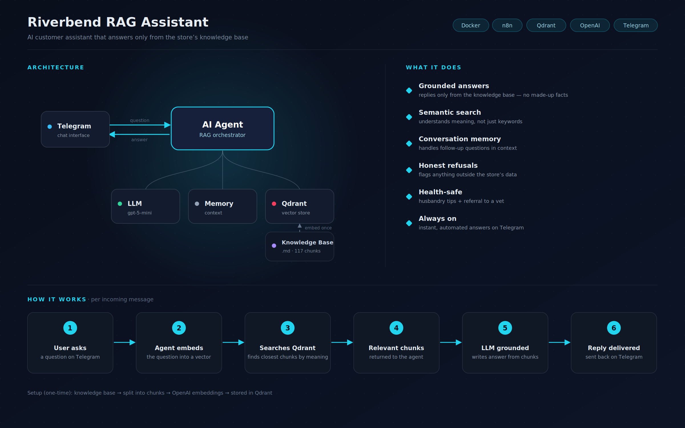

# Riverbend RAG Assistant 🐠

An AI customer-support chatbot for a specialty pet store that answers **strictly from a private knowledge base** — no hallucinations, no made-up prices or care advice. Built as a **Retrieval-Augmented Generation (RAG)** system in n8n, with Qdrant as the vector store, OpenAI embeddings, and a Telegram interface.

`n8n` · `Qdrant` · `OpenAI` · `Telegram` · `Docker`

---

## The problem

A specialty pet store gets the same questions over and over — opening hours, shipping and return policies, prices, and detailed care for dozens of species. Answering them ties up staff time, and a generic chatbot would confidently invent wrong care advice (a real risk when the answer affects a live animal).

This assistant answers **only** from the store's official knowledge base, 24/7, and honestly says "I don't have that" when a question falls outside its data.

---

## What it does

- **Grounded answers** — replies come only from the knowledge base, not the model's general knowledge.
- **Semantic search** — understands the *meaning* of a question, not just keywords.
- **Conversation memory** — handles follow-up questions in context.
- **Honest refusals** — flags anything outside the store's data instead of guessing.
- **Health-safe** — gives husbandry guidance and refers the customer to a vet for sick animals.
- **Always on** — instant, automated answers on Telegram.

---

## Architecture

The system is two n8n workflows around a single Qdrant collection.

**Phase 1 — Ingestion (run once).** A ~13,400-word Markdown knowledge base is read from disk, split into chunks, embedded, and stored as vectors in Qdrant.

`Knowledge Base (.md)` → `Read File` → `Recursive Text Splitter (1000 / 200)` → `OpenAI Embeddings` → `Qdrant (insert)`

**Phase 2 — Chat (every message).** A Telegram message triggers an AI Agent. The agent embeds the question, runs a semantic search against Qdrant, grounds the LLM on the retrieved chunks, and replies — keeping conversation context in memory.

`Telegram Trigger` → `AI Agent` (LLM + Memory + Qdrant retriever) → `Telegram Send`

The actual n8n chat workflow:

The knowledge base indexed in Qdrant — 117 vectors in the `riverbend` collection:

---

## Tech stack

| Layer | Tool |
|---|---|
| Orchestration | n8n (self-hosted) |
| Vector database | Qdrant (Docker, local) |
| Embeddings | OpenAI `text-embedding-3-small` (1536-dim) |
| LLM | OpenAI `gpt-5-mini` |
| Interface | Telegram Bot API |
| Local webhooks | Cloudflare Tunnel |

**Knowledge base:** 22 species care sheets, store policies, equipment guides, and FAQs → **117 chunks** indexed in a Qdrant collection (1536-dim, cosine distance).

---

## How it works (per message)

1. User asks a question on Telegram.
2. The agent embeds the question into a vector.
3. It runs a semantic search in Qdrant and retrieves the closest chunks.
4. The relevant chunks are returned to the agent.
5. The LLM is grounded on those chunks and writes the answer.
6. The reply is delivered back on Telegram.

---

## Engineering decisions & challenges

This is where most of the real work happened.

- **Chunking strategy.** Recursive character splitting at **1000 chars / 200 overlap** — large enough to keep a care-sheet section coherent, with overlap so a fact split across a boundary isn't lost.
- **Grounding.** The system prompt and the retriever tool description both force the agent to answer only from retrieved documents and never to claim something is "from our notes" unless it actually appears in the results.
- **Fighting near-miss hallucinations.** The hardest problem: when asked about a species *not* in the knowledge base (e.g. a chameleon), semantic search still returns the nearest real chunks (gecko / lizard care sheets), and the model would generalize them onto the wrong species. I constrained this with an explicit allow-list of covered species and a deterministic refusal for anything outside it.
- **Conversation memory.** A session-scoped memory keyed on the Telegram chat ID, so follow-up questions ("what do they eat?") resolve correctly per user.
- **Local dev workflow.** Qdrant in Docker; Cloudflare Tunnel to expose the local n8n webhook to Telegram (the tunnel URL rotates each session, so the workflow is re-published per run).

---

## Limitations & production roadmap

The species allow-list is a pragmatic guardrail, not a hard wall — it relies on the model following instructions. For a production deployment I'd:

- Add a **similarity score threshold** (or a dedicated classifier-router) so weakly-matching chunks never reach the agent.
- Expand and structure the knowledge base, and add a re-indexing flow for updates.
- Move from local hosting to a **VPS** for 24/7 uptime, and swap the dev tunnel for a stable webhook.

---

## Demo

https://github.com/user-attachments/assets/74603447-5981-48b5-aeca-ab2785bdcfa9

▶ **[Watch the demo](https://github.com/ihor-automation/riverbend-rag-assistant/blob/main/raw%20bot%20.mp4)** — grounded answers on store hours, species care, compatibility, and policies, plus a health question handled safely and an honest refusal when a question falls outside the knowledge base.

---

## Repository contents

- `RAG – Telegram.json` — the n8n chat workflow (agent + retriever + memory)
- `riverbend_overview.png` — system overview
- `sc n8n.png` — the n8n workflow canvas
- `sc qdrant.png` — the Qdrant collection (117 vectors)
- `raw bot .mp4` — demo video

---

*Built by [Ihor](https://github.com/ihor-automation) — AI automation engineer focused on practical, business-ready chatbots and workflows.*
